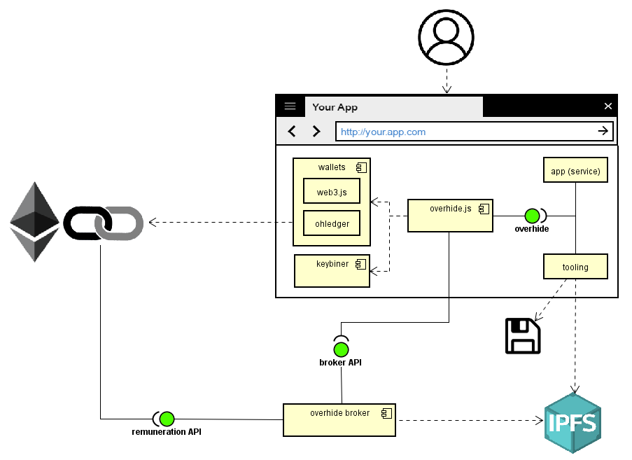

# overhide

*Over*tly *hide*: a system to store users' data within their purview and to free client-software developers from the responsibility for their users' data.

## About

At it's core *overhide* is solving a people problem.  Consider an app developer who wants to create something, but doesn't want to front time, money, resources, into infrastructure to support the solution.  Further consider a user who wants to use said service, but doesn't want to worry about who they're trusting with their data and information.  

We're building a software ecosystem to allow users of online client-software (applications/Web services) to remain pseudonymous and in full control of their data, without sacrificing data availability or impacting user experience.  The users' data is hosted online providing all the availability benefits, but the hosts--known as data-brokers--do not know what the data is or who the users are.  The client-software necessarily interprets their users' data so as to be useful, but the users can retain their pseudonymity.

The client-software developers benefit from this ecosystem by having available data backends they don't need to administer and maintain.  They are absolved of being responsible for their users' data as the users themselves are empowered with their own data security: no data-breaches.  The client-software developers need only focus on their software's functionality.

A necessary quality of the software ecosystem is that the data-broker hosts, as well as the client-software authors, can be remunerated despite their users being pseudonymous.  The data-brokers and the client-software can be commercial offerings.  Additionally, the remuneration to the data-brokers and software clients can be in the form of fiat money or crypto-currencies.

Overhide's mission is to make available open-source software enabling data-brokers with the above qualities.  Overhide intends to run and maintain data-broker instances, to host necessary and related infrastructure, and offers the aforementioned remuneration framework.

The remuneration framework is flexible enough to be usable for fiat money today--hence accessible to the vast majority of online users--while future-proofing against rewrites of client-software for any new crypto-currencies in the future.

---

Within this repo you will find documentation and API specifications relevant to *overhide*.  Implementations of these APIs constitute *overhide* deployments that act together to broker storing of a service's user data with qualities described above.

The heart of *overhide* is a "broker" between a "service" and a "user".  It is a data-store that is completely uninterested in what the "service" is and who the "user" is.

A "service" could be an app who's authors don't want to be in the business of managing a backend for users' data.

A "user" could be a person who wants to own all the data used by the "service" and wants to remain pseudonymous to both the *overhide* "broker" instance and the "service".

For reference, below is a sample model of the above mentioned components.  In green are the artifacts documented by this repository.

The model shows a browser with *overhide's* [*keybiner*](#secrets-and-the-keybiner) abstracted by [*overhide.js*](#overhidejs) and exposed to the *app (service)* through its (green) [*overhide* interface](#overhidejs).  The [*keybiner*](#secrets-and-the-keybiner) is a widget to deal with credentials and [*overhide.js*](#overhidejs) is an implementation of the *overhide* JavaScript client API.  The [*overhide.js*](#overhidejs) references [ledger APIs](#remuneration-api) (*web3.js*, [ohledger.com](https://ohledger.com)) as injected by [*wallets*](docs/glossary.md#wallet) and libraries.  The [ledger APIs](#remuneration-api) as well as the *overhide broker* are seen using the *Ethereum blockchain*.  The broker is also seen using [*IPFS*](https://ipfs.io/) for persistence.  This is but one model of possible implementation patterns; it is the reference model.  There is nothing precluding a service or tooling written in any language from using the APIs directly, going against another ledger, or a completely different remuneration mechanism altogether (as long as it implements [remuneration API](#remuneration-api)).

* a user uses the Web app, persisting and sharing data via *overhide*
* a user interfaces with an Ethereum blockchain using their [*wallet*](docs/glossary.md#wallet) browser module--external to *overhide*, optionally paying service and broker subscriptions
* the app (service) code interfaces with the ledger via *overhide.js*, a clean abstraction to initiate payment of service and broker subscriptions with a cohesive UX wrapper
* a user interfaces with a [*keybiner*](#secrets-and-the-keybiner) to group--in a user-friendly way--all the credentials, secrets, and *overhide* references as used by a given app (service)
* All the [*wallet*](docs/glossary.md#wallet) and the [*keybiner*](#secrets-and-the-keybiner) modules are decoupled from the app (service)
* the [*wallets*](docs/glossary.md#wallet) inject ledger libraries--such as Ethereum's *web3.js* JavaScript library--making it available to any in-browser app, service, or tool; albeit it's advisable to avoid direct use and decouple with *overhide.js*.
* the [*keybiner*](#secrets-and-the-keybiner) is a standalone Web widget--making it available to any in-browser app, service, or tool (or a "Web view")
* the *overhide* broker uses [*IPFS*](https://ipfs.io/) for distributed persistence of the data
* the "user data" structure in [*IPFS*](https://ipfs.io/) is openly specified and accessible to user with external [*IPFS*](https://ipfs.io/) *tooling*
* the user has flexibility to point the app (service) to another [*IPFS*](https://ipfs.io/) compatible *overhide* broker to access their data
* the user has flexibility to use external "tooling" to import/export their data to a completely different implementation of an *overhide* broker, non-[*IPFS*](https://ipfs.io/)
* both the app (service) and tooling use the *overhide.js* "client library" to interface with an *overhide* broker

### Qualities of *overhide*

* open source specifications: to enable storing of data in the open
   * broker API for data storage
   * [remuneration API](#remuneration-api) to enable payment of brokerage and service subscriptions
   * client library to promote decoupling of trust
* as available and reliable as the technology stack implementing the specification; the [reference implementation](https://github.com/overhide/overhide-broker) is geared to be both
* provides ability to remunerate brokerage and service provider via various ledgers: pseudonymous subscription fees
* [decentralized](docs/decentralization.md); *overhide* broker is discoverable via [broker-lookup](docs/lookup.md) from *Web 2.0* stacks, and broker can be [easily switched out](https://overhide.github.io/overhide/docs/broker.html#tag-data-stewardship) when need arises. 

### Benefits to Service/Application

* no need to administer a backend: outsource reliability and availability to experts
* no need to be responsible for user data: empower user with their data security, no data breaches
* no API keys in client code or code metadata executing in unprotected contexts (browsers)
* General Data Protection Regulation (GDPR) compliance
* no need to worry about who the users are: they're pseudonymous shadows
* no need to deal with user passwords, password complexity, password recovery
* can still collect service subscription fees using APIs via various ledgers

### Benefits to User

* user owns their data
* *overhide.js* secures user's data client side--secured before leaves the browser
* user can validate security of their data: user has transparency into *overhide* broker to validate encryption by service
* user has the option to treat their online data like any other local computer application data; back it up, export, import, move providers.  
* user continues to have all the availability and reliability benefits of storing data in the cloud/on-prem server

### Expected Use Cases

The above benefits can only be reaped for certain expected use-cases of a "service".

* only suitable for certain data patterns where service's data can be reasonably expected to be fully managed within a rich client application: no use of [SQL relational data, database-engine, indices](docs/exposed.md), server-side processing, or server-side third-party integrations
* suitable to make decentralized apps (DApps) regardless of their use of ledger technology: seems the right fit for DApps' off-chain data and no-chain DApps

## Where To?

Click through the flowchart below and decide how to jump around this material.

## [Glossary & Notation + Canonical Specifications](docs/glossary.md)

Please refer to the [glossary](docs/glossary.md) to get comfortable with terms and notation syntax used within the repo.

Includes canonical specification of algorithm choices and other conventions.

## [Identity](docs/identity.md)

Aim of *overhide* is to keep data private.  Anonymity is an important part of privacy.  See how [*overhide* leverages pseudonymous identity](docs/identity.md) to remunerate brokers.

## [Secrets and the Keybiner](docs/secrets-keybiner.md)

The *overhide* system deals with *hostnames*, *addresses*, *secret-keys*, *secret-phrases*, *secret-seeds*--the [secrets write-up](docs/secrets-keybiner.md) discusses these and how they are reigned-in with the help of the [keybiner widget](docs/secrets-keybiner.md).

## [Delegation and Subletting](docs/delegation-subletting.md)

Helping maintain users' data ownership is a major task of *overhide*; however, not all user's are interested in taking the reigns right away.  The [delegation and subletting write-up](docs/delegation-subletting.md) touches on two mechanisms to onboard users onto a service without forcing them to immediately take control of their data.

## [overhide.js](docs/overhide.js.md)

> The *overhide.js* library is currently being shaped into a *minimally viable product* before first release.  There is a [subset of features planned](docs/mvp.md) to be released.

This [overhide.js JavaScript client library](docs/overhide.js.md) provides the client implementation of the [*overhide* APIs](#broker-api).  [The library](docs/overhide.js.md) benefits app/service developers in the standard ways.

By convention [this library](docs/overhide.js.md) is to be provided in the global context via an `overhide` object.

## overhide.c

> The *overhide.c* library is on a back-burner pending *minimally viable product* release of other components.

The *overhide.c* linkable client library provides the client implementation of the [*overhide* APIs](#broker-api) externalized as *C* calls.  The library doesn't provide widgets such as the [keybiner](#secrets-and-the-keybiner) or abstraction of [*wallets*](docs/glossary.md#wallet), but smooths out broker interaction with a plethora of languages--C/C++, Golang, Python, etc.; the world is not just JavaScript and peaches.

## [Data Decentralization](docs/decentralization.md)

A core value of *overhide* is to keep user data [decentralized](decentralization.md) or at least [portable](decentralization.md#client-driven-quasi-decentralization).  The [overhide API](https://overhide.github.io/overhide/docs/broker.html) works in conjunction with resilient distributed persistence networks.

[The *overhide* reference implementation upholds data decentralization](docs/decentralization.md) in its solution.

## [Broker Trustlessness](docs/trustlessness.md)

Brokers are trusted to write-out your data only as far as [Ethereum](https://www.ethereum.org/) or [Bitcoin](https://bitcoin.org) nodes are trusted to write-out your transactions.  Brokers are your agents to the network and are economically incentivized to do the right thing as network peers.

The [*overhide* API minimizes required trust](docs/trustlessness.md).

## [Broker-Lookup:  On Targeting Data Hosts with Users' Ledger Addresses](docs/lookup.md)

Users do not need to carry around and make available their data-hosting broker information for routine service access.  Services can leverage [broker-lookup](docs/lookup.md) when provided with just the public [user-address](glossary.md#user-address) associated with the data.

## [Broker API](https://overhide.github.io/overhide/docs/broker.html)

An [API](https://overhide.github.io/overhide/docs/broker.html) exposed by *overhide* broker, provides access to broker's services.

> An *overhide.io* broker instance with a [*minimally viable product* feature-set](docs/mvp.md) is planned first.

## [Remuneration API](docs/remuneration-api.md)

The *overhide* [Remuneration API](docs/remuneration-api.md) enables [ledger-based authorization](https://github.com/overhide/ledgers.js/blob/master/why/why.md) and permeates *overhide* features.

## [On Applicability of a Key-Value Store](docs/state-funnel.md)

An example of *overhide* [applicability](docs/state-funnel.md) to a problem customairly solved with a relational database in the back-end.

## [On Authorizations and Exposed Source Code](docs/exposed.md)

A [brief](docs/exposed.md) on dealing with authorization code-flows with source code exposed by user-agents such as browsers.

## [Tell Your Users](docs/your-data-be-yours.md)

The following page contains assets to include and link into your application or service--to tell your users that:

* they own their data
* their data is encrypted before it leaves their browser
* they continue to have all the availability and reliability benefits of the cloud

[*b*ring *y*our *o*wn *d*ata <-> *y*our *d*ata *b*e *y*ours](docs/your-data-be-yours.md).
