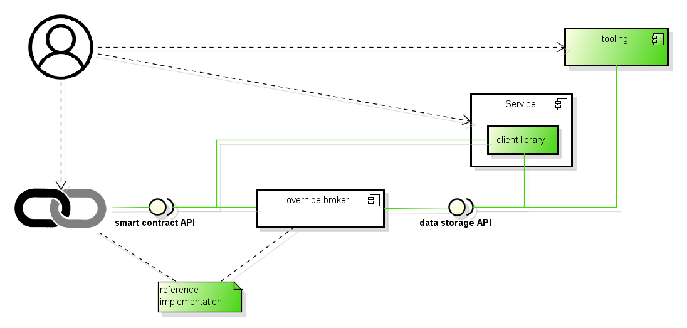

# *overhide*  

Overtly hide data: a device for hiding private data by encrypting in the open.

## About

API specifications, API reference implementations, JavaScript client library, and tooling, that act together to broker storing of a service's user data within user's purview.

The heart of *overhide* is a "broker" between a "service" and a "user".  It is a data-store that is completely uninterested in what the "service" is and who the "user" is.

A "service" could be an app who's authors don't want to be in the business of managing a backend for users' data.

A "user" could be a person who wants to own all the data used by the "service" and wants to remain pseudonymous to both the *overhide* "broker" instance and the "service".

For reference, below is a model of the above mentioned components.  In green are the artifacts provided by this repository.

* a user can interface with the blochchain external to *overhide*
* a user can leverage the "service" to transact on the blockchain (e.g. pseudonymously add funds for "broker" use)
* a user uses the "service" to work with data (e.g. persist application data)
* service uses "client library" to interface with blockchain and *overhide* broker
* *overhide* provides "tooling" for working with data stored by broker: (e.g. import/export of user data)

### Qualities of *overhide*

* open source specifications: to enable storing of data in the open
 * broker API for data storage
 * smart contract API to remunerate brokerage
* as available and reliable as the technology stack implementing the specification
* provides ability to remunerate brokerage provider via blockchain: pseudonymous brokerage fee

### Benefits to Service

* no need to administer a backend: reliability and availability
* no need to be responsible for user data: breaches
* no need to worry about who the users are and user security: they're pseudonymous shadows
* retains option to implement own *overhide* brokerage, own blockchain/tokens (leverage that business model); but *overhide* won't help making it proprietary

### Benefits to User

* user owns their data
* data is as secure as the user's access to it, and service's use of it
* depending on service, user might have flexibility to choose own *overhide* broker

### Expected Use Cases

The above benefits can only be reaped for certain expected use-cases of a "service".

* only suitable for certain data patterns where the data can be reasonably expected to be fully managed in a rich client application: no benefit of SQL relational data, database-engine or server-side processing, server-side third-party integrations
* suitable to make decentralized apps (DApps) regardless of their use of blockchain technology: seems the right fit for DApps' off-chain data

### [Glossary](docs/glossary.md)

Please refer to the [glossary](docs/glossary.md) to get comfortable with terms used within the repo.

## Quick Start
