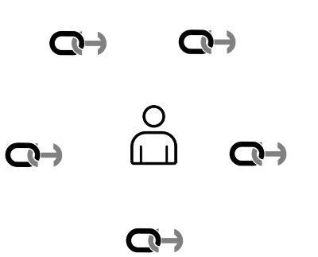
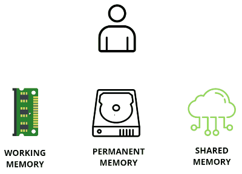

# Data Decentralization

## Data Stewardship

Data decentralization in *overhide* is supported by an explicitly managed network of [data-stewards](glossary.html#data-steward).  

*Data-stewards* are all *overhide* brokers on the same distributed persistence network to which a user pays a subscription: a subset of all *overhide* brokers on the network.

An *active data-steward* is a subscribed-to *overhide* broker that the user interacts with for mutating data.  Only one *overhide* broker can be delegated as an *active data-steward* (see "Data Mutation Speed Considerations" below).

A *passive data-steward* is any other subscribed-to *overhide* broker.  There can be many *passive data-stewards*.  These are read-only.  These guarantee to make the user's data available as soon as it's shared with them by the *active data-steward*.  A *passive data-steward* can be made "active" at any time; it's prudent to deactivate any previously *active data-steward*.

All nodes on the broker's distributed persistence network may receive and make-available the user's data; but the *stewards* ensure to pin the user's data and guarantee its availability.

## Data Mutation Speed Considerations

Ideally data changes would be immediately finally consistent all across a distributed persistence network.  This is not feasible in practice.

User's data mutations go to a specially nominated *active data-steward* before being propagated to other peers.  Each data change progresses through three [persistence-levels](glossary.html#working-memory-permanent-memory-shared-memory-persistence-status):

* [working-memory](glossary.html#working-memory-permanent-memory-shared-memory-persistence-status)
* [permanent-memory](glossary.html#working-memory-permanent-memory-shared-memory-persistence-status)
* [shared-memory](glossary.html#working-memory-permanent-memory-shared-memory-persistence-status)

Each level operates at different update speeds.  Data propagation could be superceded at any level by a faster rate of change upstream.

The [working-memory](glossary.html#working-memory-permanent-memory-shared-memory-persistence-status) and [permanent-memory](glossary.html#working-memory-permanent-memory-shared-memory-persistence-status) are part of the *active data-steward*.  Only changes that progress to [shared-memory](glossary.html#working-memory-permanent-memory-shared-memory-persistence-status) can be pinned by *passive data-stewards* and made available by nodes on the distributed persistence network. 

The SHA-256 content-hashes of any [segment-key](glossary.html#segment-key) value can be retrieved for each [persistence-level](glossary.html#working-memory-permanent-memory-shared-memory-persistence-status): use the [GET /{segment-key}/persistence-status](broker.html#operation---segment-key--persistence-status-get) API call.  On an active steward equivalence between the [shared-memory](glossary.html#working-memory-permanent-memory-shared-memory-persistence-status) hash and the [working-memory](glossary.html#working-memory-permanent-memory-shared-memory-persistence-status) hash means consistency is achieved.  On a passive steward data is driven by the [shared-memory](glossary.html#working-memory-permanent-memory-shared-memory-persistence-status) value; all hashes would be the same, always.  A client can use this API to validate data propagation, pining, hosting, to passive stewards.

## Other Considerations

A user has ultimate control over their data.  A core-value of *overhide* is that users are always able to extract all of their data from any *overhide* system (provided they know their credentials).  The data may be exported from one *overhide* system and imported into another--presumably with incompatible underlying distributed persistence networks.  Users can leverage tooling that uses the [import](broker.html#operation-import-WIRE)/[export](broker.html#operation-export-WIRE) functionality of *overhide* broker APIs to extract all their data so they can do with it as they please.  That's a contractual obligation on a proper *overhide* broker implementation.

 

The intent of *overhide* is to go as far as possible to bring decentralization to our apps, with the hope that one day the broker is completely out of the picture and only [*overhide.js*](overhide.js.md) remains as a library, not a client shim. 

 

## [Broker API](broker.html) Support For Decentralization

Refer to the [Broker API](broker.html#tag-data-stewardship) to read about how the APIs support data decentralization.

## Overview of [*overhide* Reference Implementation](https://github.com/JakubNer/overhide-broker) and [*IPFS*](https://ipfs.io/)

The [*overhide* broker reference implementation](https://github.com/JakubNer/overhide-broker) uses [*IPFS*](https://ipfs.io/) for its decentralized persisted data.

All user data and data-specific metadata is stored on the [*IPFS*](https://ipfs.io/) network.

Broker specific metadata--e.g. configuration and session information--is not stored on the [*IPFS*](https://ipfs.io/) network.

A broker facilitates a connection to [*IPFS*](https://ipfs.io/) and enforces an *overhide* specific data structure on [*IPFS*](https://ipfs.io/).  It enables current *Web 2.0* services to leverage [*IPFS*](https://ipfs.io/) through the *overhide* abstraction.

#### [*Identity*](identity.md) Child Directories

An [*identity*](identity.md) is a token calculated client-side--in *overhide.js*.  To an *overhide* broker an [*identity*](identity.md) certifies a user owns the public key used for broker remuneration.  It is also used to create a directory to contain all the data, metadata, and backchannel queues for [*segment-keys*](glossary.md#segment-key) owned by the user.

Each broker is a steward of its users' data in an instance-local repository (*/repo*).  This repository has a folder for each of the users with their [*identity*](identity.md) as the directory name.  These folders are constantly updated in [*IPFS*](https://ipfs.io/) and [*IPNS*](https://docs.ipfs.io/guides/concepts/ipns/) as users work with their data--this necessarily means that each [*identity*](identity.md) has its own private-public [*IPNS*](https://docs.ipfs.io/guides/concepts/ipns/) key-pair.  The public key constitutes a [*GUID* (globally unique ID)](broker.html#/definitions/GUID), which is the user's data content-root on the [*IPNS*](https://docs.ipfs.io/guides/concepts/ipns/) network.  Ideally, on each change of the user's data, the [*IPFS*](https://ipfs.io/) merkle-dag is updated and the [*IPNS*](https://docs.ipfs.io/guides/concepts/ipns/) snapshot is re-referenced.  Realistically the [*IPFS*](https://ipfs.io/) network--and especially the slower [*IPNS*](https://docs.ipfs.io/guides/concepts/ipns/) reference to the most recent data--is only eventually consistent as seen by other brokers.

As each user modifies their data, the broker updates [*IPFS*](https://ipfs.io/), necessarily pins all the content, and re-publishes to [*IPNS*](https://docs.ipfs.io/guides/concepts/ipns/) under the user's [*IPNS*](https://docs.ipfs.io/guides/concepts/ipns/) public-key hash (see [`ipfs name publish`](https://ipfs.io/docs/commands/#ipfs-name-publish))--[the *GUID*](broker.html#/definitions/GUID).  The broker makes the user's [*GUID*](broker.html#/definitions/GUID) available to the app (service) [via APIs](broker.html#operation--guids-get).  Armed with [the *GUID*](broker.html#/definitions/GUID) the user can use tooling to directly access their most recent data on [*IPFS*](https://ipfs.io/)--allowing for publishing delay--or [direct their app (service) to use a different broker](broker.html#operation--all-data-post) to work with their data.

#### Data as Files

A broker writes data to local files under *//repo/[\<identity>](identity.md)/[\<segment-key>](glossary.md#segment-key)/[\<identity>](identity.md).  All of a user's owned content is under their *//repo/[\<identity>](identity.md)/* subfolder.  The data itself sits in the file named with [identity](identity.md) as file name.  This is to distinguish the owner's data from [delegate data](broker.html#tag-delegate).

This data is navigable via [*IPNS*](https://docs.ipfs.io/guides/concepts/ipns/) by dereferencing *\<GUID>/[\<segment-key>](glossary.md#segment-key)/[\<identity>](identity.md)* where *GUID* is the [*identities*](identity.md) [*IPNS*](https://docs.ipfs.io/guides/concepts/ipns/) public-key hash.

The data is encrypted in a [usage specific way](glossary.md#datastore-value-secret).

#### Delegate Data as Files

[Delegate data](broker.html#tag-delegate) resides in *//repo/[\<owner-identity>](identity.md)/[\<segment-key>](glossary.md#segment-key)/[\<delegate-identity>](identity.md).  The *owner-identity* subfolder is the [identity](identity.md) of the owner of the referenced [*segment-key*](glossary.md#segment-key).  The *delegate-identity* file contains the [delegate data](broker.html#tag-delegate) and is named with the delegate's [identity](identity.md) as file name.

The delegage data is navigable via [*IPNS*](https://docs.ipfs.io/guides/concepts/ipns/) by dereferencing *\<GUID>/[\<segment-key>](glossary.md#segment-key)/[\<delegate-identity>](identity.md)*.

The data is encrypted in a [usage specific way](glossary.md#datastore-value-secret).

#### [Messages](glossary.md#backchannel-queue) as Files

All backchannel queues for an identity are filed under *//repo/[\<identity>](identity.md)/[\<segment-key>](glossary.md#segment-key)/backchannel/[\<identity>](identity.md).  The queue is stored as a file with [identity](identity.md) as the file name.  This is to distinguish the owner's backchannel from [delegate's backchannels](broker.html#tag-delegate).

Each queue is navigable via [*IPNS*](https://docs.ipfs.io/guides/concepts/ipns/) by dereferencing *\<GUID>/[\<segment-key>](glossary.md#segment-key)/backchannel/[\<identity>](identity.md)*.

The messages are encrypted in a [usage specific way](glossary.md#datastore-value-secret), decipherable by recipient upon receipt.

#### Delegate [Messages](glossary.md#backchannel-queue) as Files

Delegate's messages are filed under *//repo/[\<owner-identity>](identity.md)/[\<segment-key>](glossary.md#segment-key)/backchannel/[\<delegate-identity>](identity.md).  The *owner-identity* subfolder is the [identity](identity.md) of the owner of the referenced [*segment-key*](glossary.md#segment-key).  The *delegate-identity* file contains the [delegate backchannel queue](broker.html#tag-delegate) and is named with the delegate's [identity](identity.md) as file name.

Each queue is navigable via [*IPNS*](https://docs.ipfs.io/guides/concepts/ipns/) by dereferencing *\<GUID>/[\<segment-key>](glossary.md#segment-key)/backchannel/[\<delegate-identity>](identity.md)*.

The messages are encrypted in a [usage specific way](glossary.md#datastore-value-secret), decipherable by recipient upon receipt.

#### Access Metadata as Files

Metadata for a specific [*segment-key*](glossary.md#segment-key) lives under *//repo/[\<identity>](identity.md)/[\<segment-key>](glossary.md#segment-key)/.metadata* file.

Each queue is navigable via [*IPNS*](https://docs.ipfs.io/guides/concepts/ipns/) by dereferencing *\<GUID>/[\<segment-key>](glossary.md#segment-key)/.metadata*.

This file is not meant for consumption by the user, but by *overhide* systems; these files are plain-text with pseudonymous content.