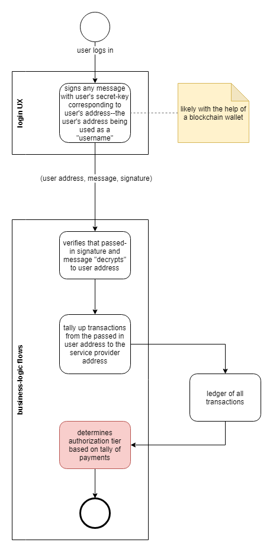

# Authorizations and Exposed Source Code

When authoring a service or application that wholly runs in a user-agent such as a browser, you must be cognizant that the application source code is in the clear and modifiable.

Minifiers such as [uglify.js](https://www.npmjs.com/package/uglify-js) obfuscate code and make it less comprehensible, but that only slows down bad actors who intend to copy the code and modify it.

This becomes an issue when your business-logic has code flows conditional on authorization tiers.

## ledgers.js

The *overhide* [ledgers.js](https://www.npmjs.com/package/ledgers.js) library helps a user authenticate, review authorizations, and top-up payments as necessary.  The library--for its intended purposes--has its place in the *login UX* portion of *overhide's* [ledger-based authorization flow](https://github.com/overhide/ledgers.js/blob/master/why/why.md).  



*Figure 1: Ledger-based authorization flow.*

The library can be used in a browser without any caveats for bad actors modifying the source code--as the *login UX* exposes ledger tallies for information purposes only.  It allows signing for identity and popping-up widgets for transacting, but these are all user provided aspects.  The bad actor--being the user here--doesn't gain anything by hacking away at the *login UX*.

## The Problem

With reference to figure 1 above, authorization occurs down in the *business-logic* (task in red).  When the *business-logic* runs wholly in a browser, the wrong thing to do would be to check signature legitimacy and fetch ledger tallies right then and there, in browser code, directly using [remuneration APIs](remuneration-api.md) or [ledgers.js](https://www.npmjs.com/package/ledgers.js).

Consider the sample code of such *business-logic*:

```
var uri = ...; /* https://ohledger.com/v1, https://ethereum.overhide.io, or ... */
var fee = ...;
var isAuthorizedForExtraGoodies = false;

...

fetch(`${uri}/get-transactions/${from}/${to}?tally-only=true${since}`)
  .then(res => res.json())
  .then(res => {
    if (res.tally >= fee) {
      isAuthorizedForExtraGoodies = true;
    }
  })
  .catch(e => {
    ...
  });

...

if (isAuthorizedForExtraGoodies) {
  
  ...

  // functionality paid for

  ...

}
```

When a tally of transactions comes back (`fetch->then`), if it meets some `fee` expectation, the boolean that allows code flows with extra goodies is set to *true* (`isAuthorizedForExtraGoodies = true`)

There is nothing stopping a bad actor from flipping that boolean using developer tools right in the browser:  gaining access to extra goodies for free.

## The Solution

The solution is to put the authorization portion of the *business-logic* in a back-end.  But--since we're here--we don't want to write our own back-end.  We're expecting to leverage the value-proposition of having the [*overhide* broker as a back-end](https://overhide.io/#6/p6-1).

So how can we design our interactions with the *overhide* broker to protect ourselves?

To do so we need to instrument our solution leveraging the following concepts:

* your user will authenticate as [your guest, your visitor](glossary.md#invitee-visitor-guest)
* the tuple being sent from the *login UX* to the *business-logic* (figure 1) is now the tuple that's sent from the browser to the *broker*
    * [PUT /auth/guest-credentials](https://overhide.github.io/overhide/docs/broker.html#operation--auth-guest-credentials-put)
* you must set some *entry-fees* on some [segment-keys](glossary.md#segment-key) in the broker
    * *entry-fees* are set using [datastore-key settings](https://overhide.github.io/overhide/docs/broker.html#tag-datastore-key-settings)
    * see `entry-fee` attribute of [DatastoreKeySettings](https://overhide.github.io/overhide/docs/broker.html#definition-DatastoreKeySettings) 
* you must leverage whatever data provided by the above *segment-keys* in the critical paths of your *extra-payment-required* code flows
    * should be a core piece of data to this functionality
    * should be a dynamic piece of data that depends on other aspects of your solution
        * at least changing with each release
        * optimally constantly changing without which your application is gimped
    * perhaps an in-app routing look-up-table?
    * perhaps a core [backchannel](glossary.md#backchannel-queue)?

Even with the above in-place, the bad actor might take the effort to always update their hack.

The bad actor might go as far as stand-up their own data-set for their hack of your application on their own broker.

At the end of the day a bad actor is not a legitimate user and majority of your efforts should likely focus on supporting legitimate users.  Keep your fees fair and your updates frequent.

The challenge discussed above--and the counter-measures--are the same facing [Progressive Web Apps](https://developers.google.com/web/progressive-web-apps/) in offline mode: [see this thread](https://www.reddit.com/r/PWA/comments/b5ugcg/counters_to_inbrowser_hacks_of_offline_pwas/).

