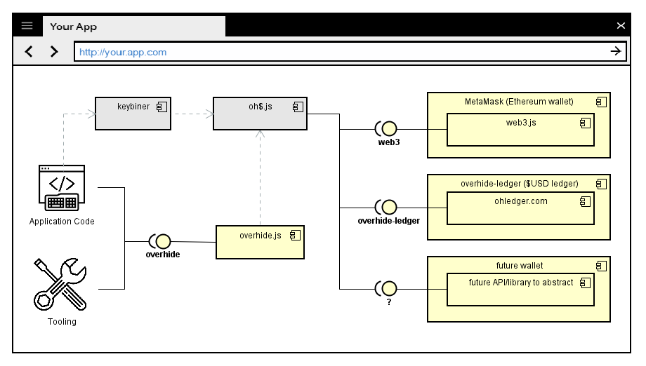

# *overhide.js*

*overhide.js* is the JavaScript client interface to the *overhide* system.  

Its intent is to be an all-encompassing library enabling access to all features of the *overhide* system.

*Application code* and *tooling* are written against the *overhide* interface.

The *overhide* interface is made concrete by [*overhide.js*](https://github.com/overhide/overhide.js).  The [*overhide.js*](https://github.com/overhide/overhide.js) library is brought in by *application code* as a dependency.

The [*overhide.js*](https://github.com/overhide/overhide.js) library depends on [ledgers.js](https://www.npmjs.com/package/ledgers.js) to abstract interaction with public ledgers--to the extent that is needed by *overhide*.  For example the *web3*, [*overhide-ledger*](https://ohledger.com), and *?*, interfaces modeled.  The application's customers interact with their [*wallets*](docs/glossary.md#wallet) of choice, whose interfaces to *overhide* are normalized with [ledgers.js](https://www.npmjs.com/package/ledgers.js).

The [*overhide.js*](https://github.com/overhide/overhide.js) library is injected with [ledgers.js](https://www.npmjs.com/package/ledgers.js) which targets ledger credentials an app user wants to use during login, when authorizing with *overhide*.  The [ledgers.js](https://www.npmjs.com/package/ledgers.js) library is the in-browser "login" helper library and works in conjunction with the [remuneration API](remuneration-api.md).

The [keybiner](secrets-keybiner.md#keybiner) is an optional widget to simplify management of ledger credentials.

Hence a user of some *application code* uses their wallet of choice and perhaps a password-manager / form auto-fill; with some or all credentials management simplified through the [keybiner](secrets-keybiner.md#keybiner) widget.  Regardless, the user's ledger credentials make their way to [*overhide.js*](https://github.com/overhide/overhide.js) through [ledgers.js](https://www.npmjs.com/package/ledgers.js).
