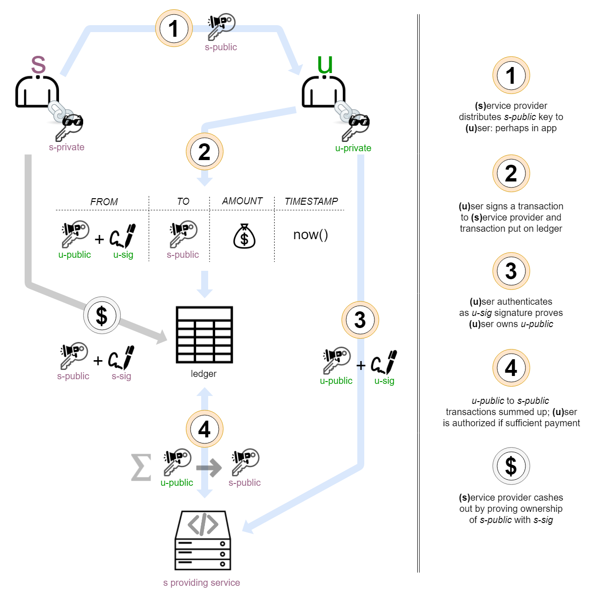
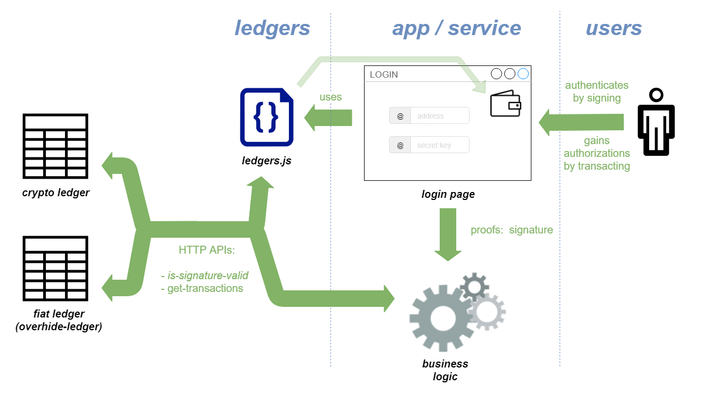

# Remuneration API

## Ledger-Based Authorization

([video introduction](https://www.youtube.com/watch?v=moc1P9W0yTk))

Core to the *overhide* system is *ledger-based authorization*; whether for-pay or gratis.

*Ledger-based authorization* is depicted in the figure below:

*Figure 1: Ledger-based authorization*

The pseudonymous entity known as *s* depicts the *service provider*.  The *service provider* keeps their private key (*s-private*) close and distributes the corresponding public-key or ledger-address (*s-public*).  The *service provider* proves ownership of *s-public* by providing signatures (*s-sig*): being able to furnish a signature proves posession of *s-private* which in turn proves ownership of *s-public*.

Step (1) is the *service provider* distributing their *s-public*: likely embedded in application code.  They *user* *u* likely doesn't need to be aware of the particulars of *s-public* other than having it provided to *u*'s wallet for transacting.

Step (2) the *user* *u* creates a transaction in order to gain access to the *service* at some payment tier (perhaps free).  The transaction includes the *user*'s public address (*u-public*) and a signature (*u-sig*) proving the *user* in fact consented to the transaction.  The transaction has the recipient address--the *service provider*'s *s-public*--along with the amount and a timestamp.

The transaction is added to a public ledger and becomes readable by any connected *service*.

Step (3) is the *user* logging into the *service* and authenticating.  Authentication is as simple as signing for the *user*'s address *u-public*.  The signature *u-sig* proves whomever furnishes the signature owns *u-public* as they claim.

That's it for authentication, as simple as providing a signature.

Step (4) is the *service* authorizing the *user* *u* with address *u-public*.  There could be multiple authorization tiers based on payments received over different time frames.  The *service* checks for tallies of ledger transactions from *u-public* to *s-public*--from the *user* *u* to the *service provider* *s*.  The tallies dictate authorization tier allowed.

In step ($) the *service provider* accesses the ledger to collect fees paid.

That was a brief on *ledger-based authorization*.  For a more detailed look, especially as it concerns US dollars, please see the [ledger-based authorization write-up](https://overhide.io/2019/03/20/why.html).

## The Remuneration API and *ledgers.js*

The Remuneration API is depicted in figure 2 below, the *HTTP APIs* in the figure.

*Figure 2: Remuneration API as used by "business logic" and "ledgers.js"*

The Remuneration API (*HTTP APIs*) is accessed directly from back-ends (*business logic*) via HTTP.  In the case of *overhide*, the *overhide* broker is the back-end accessing the Remuneration API.

The Remuneration API is accessed via helpers such as [*ledgers.js* (or *overhide.js*)](overhide.js.md) from in-browser login pages.  These JavaScript libraries provide tools and abstractions for dealing with wallets and other niceties.

The *overhide* Remuneration API enables the [ledger-based authorization](https://overhide.io/2019/03/20/why.html) flow summarized above and permeates *overhide* features starting with the root concept of [identity](identity.md) (see section on "[subscriptions](identity.md#subscriptions)").

[Ledger-based authorization](https://overhide.io/2019/03/20/why.html) is applied by *overhide* brokers on behalf of apps and services:  by virtue of using an *overhide* broker our apps and services gain full access to this authorization paradigm.

It is an API of a handful of HTTP methods exposed by various ledgers--blockchain and otherwise.

All *remuneration providers* expose an identical API contract: [just two methods](https://overhide.github.io/overhide/docs/remuneration.html): this is the static version of the [API](https://overhide.github.io/overhide/docs/remuneration.html) scrubbed from the *overhide* Rinkeby Ethereum *remuneration provider*.

At this moment we have the following *overhide* remuneration providers exposing "live" API documentation:

#### Ethereum:

* [rinkeby](https://rinkeby.ethereum.overhide.io/swagger.html)
* [mainnet](https://ethereum.overhide.io/swagger.html)

#### US Dollars:

* [test *overhide-ledger*](https://test.ohledger.com/swagger.html) with corresponding [onboarding flow](https://test.ledger.overhide.io)
* [production *overhide-ledger*](https://ohledger.com/swagger.html) with corresponding [onboarding flow](https://ledger.overhide.io)
